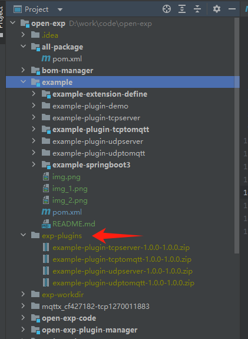

## ThingLinks Open Exp Plugin | [中文文档](README_zh.md)

# Open Exp Plugin Overview

**Open-Exp-Plugin Sample Marketplace** is a plugin repository based on the ThingLinks Open EXP extension point plugin system. It is designed to demonstrate how to develop, extend, and integrate functionalities within the ThingLinks platform. This marketplace provides a variety of plugin examples to help developers quickly get started and understand the powerful capabilities and flexibility of the plugin system.

## Features

- **Plugin Architecture**: Demonstrates the ThingLinks plugin architecture, supporting various plugin development models.
- **Hot-Swappable Support**: Plugins support dynamic installation and uninstallation at runtime without restarting the main application.
- **Multi-Tenant Support**: Supports loading different plugins based on tenant ID for customized functionality.
- **Modular Design**: Plugins and the main application adopt a modular design, supporting the isolation and integration of extension points and plugins.
- **Classloader Isolation**: Provides Parent First and Self First classloader isolation mechanisms to ensure independence between plugins.

## Usage Example

### How to Use the Plugin Sample Marketplace

1. **Enable Dependencies and Select Plugins**: Enable the `example` related dependencies in the `pom.xml` file of the `open-exp-plugin` module.

   

2. **Reload Projects**: Reload all Maven projects to ensure the dependencies are correctly loaded.

3. **Clean and Package**: Clean and package the `all-package` module.

   

4. **After Packaging**: The plugin packages are by default generated in the `exp-plugins` directory.

   

5. **Start the Main Application**: Run the `Main` class in the `example-springboot3` module.

   The main application will automatically load and install the packaged plugins. If you need to reinstall or uninstall plugins, simply call the relevant API.

### Notes

1. **Configuration Definition**: Plugin configurations should be defined in the `Boot` class.
   
   Configuration usage:
   

2. **MQTT Configuration**: In the `example-plugin-tcptomqtt` and `example-plugin-udptomqtt` plugins, MQTT server configurations should be adjusted according to the actual environment.
   

3. **Annotation Import**: Ensure that the packages imported by the `@PostConstruct` and `@PreDestroy` annotations in the plugin's entry point are correct.
   

## Core Features

- **Extension Point Interface**: Defines multiple extension point interfaces for plugins to implement.
- **Multi-Tenant Support**: Different tenants can use different plugin implementations, with support for tenant priority sorting and filtering.
- **Hot-Swappable Mechanism**: Supports dynamic loading and unloading of plugins, enhancing system extensibility and flexibility.
- **Classloader Isolation**: Ensures isolation between the plugin and the main application classloader, maintaining independence and security.

## License

[Apache License, Version 2.0](LICENSE)

## Contact

If you have any questions or need support, please contact the community team at mqttsnet@163.com.

## Source Code

The source code for this project is available at: [GitHub Repository](https://github.com/mqttsnet/open-exp-plugin)

## Join Us

We welcome you to join the **MQTTSNET Community**, where you can explore and promote IoT technology development together with developers from around the world. Through the community, you can access the latest technical information, rich development resources, and opportunities to communicate with other developers.

Visit the [ThingLinks Official Website](https://www.thinglinks.com) for more information and to join our developer community!
