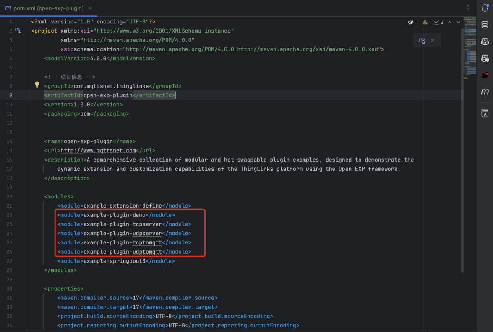
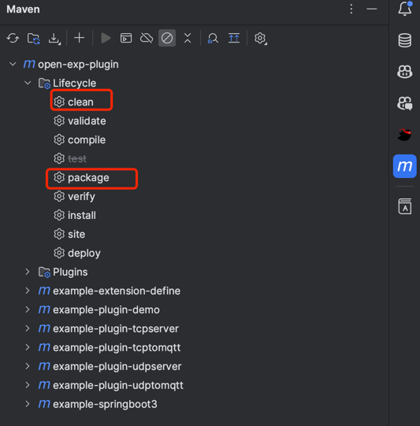
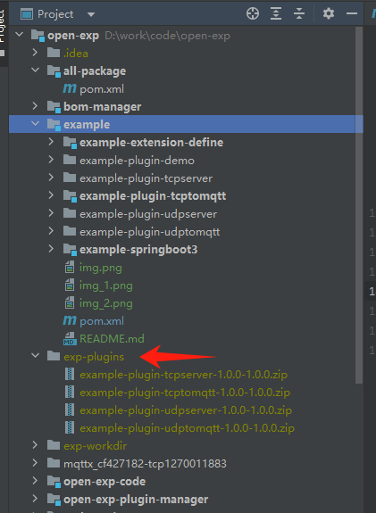
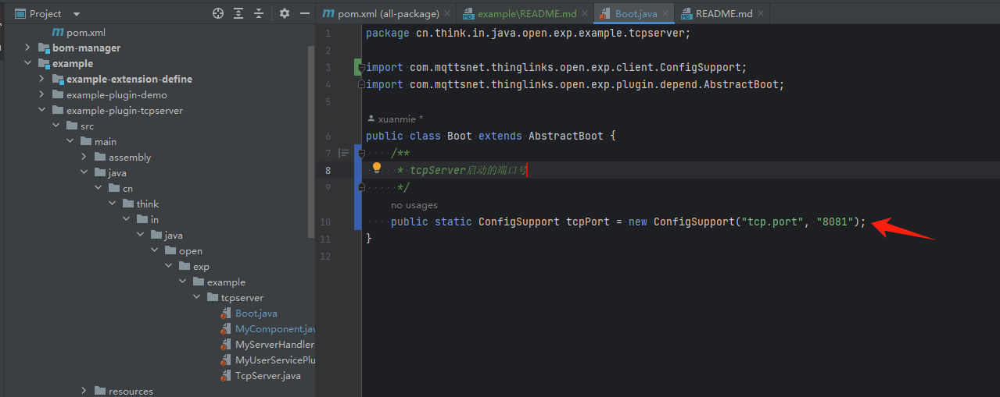
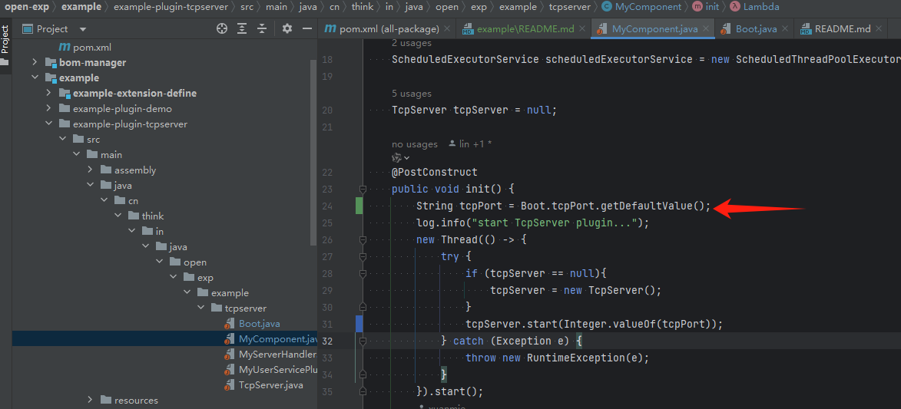
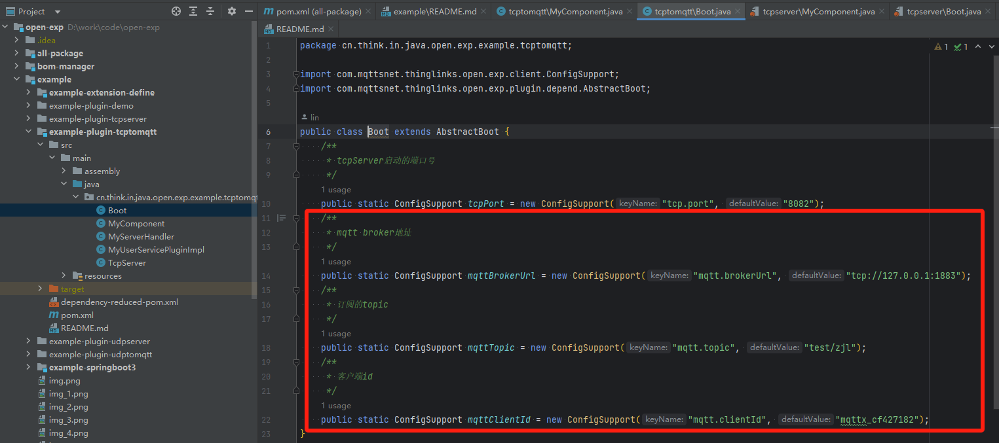
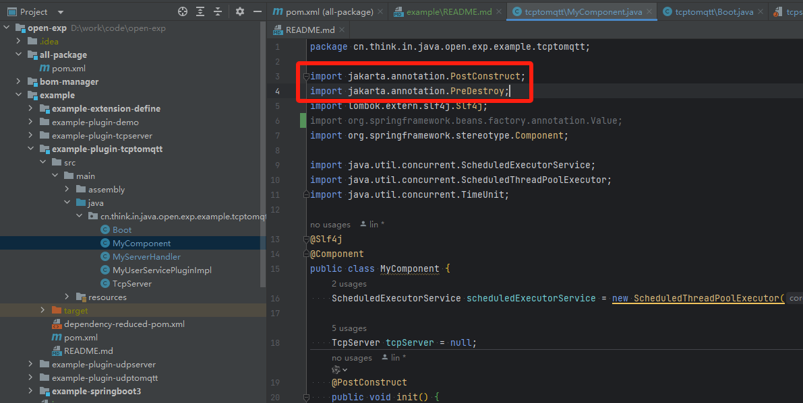

## ThingLinks Open Exp Plugin | [English Documentation](README.md)

# Open Exp Plugin 简介

**Open-Exp-Plugin 插件示例市场** 是一个基于ThingLinks Open EXP 扩展点插件系统的插件仓库，旨在展示如何开发、扩展和集成
ThingLinks 平台的功能。该市场提供了多种插件示例，帮助开发者快速上手并了解插件系统的强大功能和灵活性。

## 特性

- **插件架构**：展示了 ThingLinks 的插件架构，支持多种插件开发模式。
- **热插拔支持**：插件支持运行时的动态安装和卸载，无需重启主应用。
- **多租户支持**：支持根据租户 ID 加载不同的插件，实现定制化功能。
- **模块化设计**：插件和主应用采用模块化设计，支持扩展点和插件的隔离与集成。
- **类加载隔离**：提供 Parent First 和 Self First 两种类加载隔离机制，确保插件间的相互独立性。

## 使用示例

### 如何使用插件示例市场

1. **启用依赖并选择插件**：在 `open-exp-plugin` 模块的 `pom.xml` 文件中启用 `example` 的相关依赖。

2. **刷新项目**：重新加载所有 Maven 项目，确保依赖正确加载。

3. **清理打包**：对 `all-package` 进行清理打包操作。

4. **打包完成后**，插件包默认生成在 `exp-plugins` 目录下。

5. **启动主应用**：运行 `example-springboot3` 模块中的 `Main` 类。

主应用会自动加载并安装打包好的插件（ 即`exp-plugins` 目录下插件），如果需要重新安装及卸载插件，调用其API即可。

### 注意事项

1. **配置定义**：插件内的配置需要在 `Boot` 类中定义。
   
   配置的使用方式：
   

2. **MQTT 配置**：在 `example-plugin-tcptomqtt` 和 `example-plugin-udptomqtt` 插件中，MQTT 服务端的配置需要根据实际环境进行调整。
   

3. **注解导入**：确保插件启动入口的 `@PostConstruct` 和 `@PreDestroy` 注解导入的包是否正确。
   

## 核心功能

- **扩展点接口**：定义了多个扩展点接口，供插件实现。
- **多租户支持**：不同租户可以使用不同的插件实现，支持租户优先级排序和过滤。
- **热插拔机制**：支持插件的动态加载与卸载，提升系统的扩展性和灵活性。
- **类加载隔离**：插件与主应用之间的类加载实现隔离，确保独立性与安全性。

## 许可证

[Apache License, Version 2.0](LICENSE)

## 联系方式

如有任何问题或需要支持，请联系社区团队：mqttsnet@163.com。

## 源码

此项目的源码可在以下地址找到：[GitHub 仓库](https://github.com/mqttsnet/open-exp-plugin)

## 加入我们

欢迎加入 **MQTTSNET 社区**，与全球物联网开发者一起探索和推动物联网技术的发展。通过社区，您可以获取最新的技术资讯、丰富的开发资源，以及与其他开发者交流的机会。

访问 [ThingLinks 官网](https://www.mqttsnet.com) 了解更多信息，并加入我们的开发者社区！
